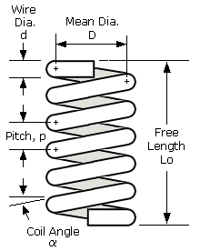

# SpringJ

 
 

  

 
 
 
SpringJ is a tool for designing optimal helical compression springs. Helical compression springs are one of the most commonly used mechanical components, found in automobiles, homes, fitness equipment, and widely used in industrial settings. The performance of the spring directly affects the working state of the machine it is in, impacting not only the efficient use of energy but also directly increasing production speed. Designing a spring to work optimally as expected is a complex problem. SpringJ aims to solve this problem!

  

## Features
SpringJ offers users the **Flexibility** to design various optimization types. 
- Users can select any combination of design parameters as target design parameters, any combination of constraints from the constraints list, and finally choose the spring attribute to be optimized from the attributes list. 
- For example, a combination of Wire diameter, Inner diameter, and Total coils can be designed to achieve the maximum Spring index and Spring ratio, while satisfying constraints such as Outer diameter, Maximum shear stress, and Coil binding gap.
- After the user makes their design, the product will perform a **Feasibility Analysis** to check the theoretical validity of their design. If the design passes the feasibility analysis, SpringJ will provide the user with the optimal design parameters!

  
| Design Parameters |   | Spring Properties |
| ----------------- | - | ----------------- |
| Wire Diameter     |   | Spring Rate       |
| Inner Diameter    |   | Spring Index      |
| Outer Diameter    |   | Preload Force     |
| Total Coils       |   | Coil Binding Gap  |
| Active Coils      |   | Buckling Slenderness Ratio |
| Free Length       |   | Maximum Shear Stress |
| Pitch             |   | Diametral Expansion |
| Open Length       |   | Stress Relaxation |
| Hard Length       |   | Spring Weight     |
| Solid Length      |   |                   |

# Benefits
## User perspective
- SpringJ has high **Flexibility** and can solve all types of spring optimization problems for users, could meet all User's needs!
- SpringJ is easy to use and does not require users to set hyperparameters, making it very user-friendly.
- One optimization result can be directly applied, making it more convenient for users.
- SpringJ has a fast convergence rate.

## Product development and algorithm usage perspective
- SpringJ has high efficiency and performance when solving low-dimensional optimization problems.
- Based on the general spring optimization scenario, which satisfies the low-dimensional nature, SpringJ is very efficient and precise.
- SpringJ's flexibility is difficult to replace with other products or algorithms.

# Demo

# How to USE
SpringJ is currently deployed on Streamlit Cloud. If you would like access, please send an email to rxt299299@gmail.com to request access!
